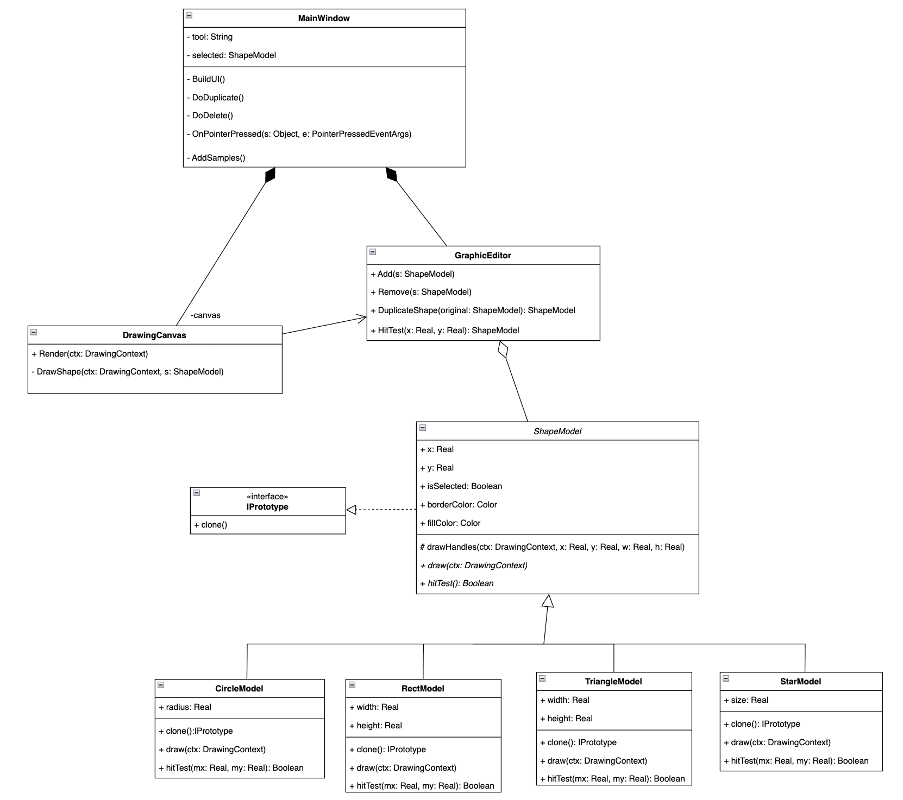

Паттерн проектирования Прототип

**Проблема на примере графического редактора**
  - В графическом редакторе есть операция "Дублировать фигуру". Метод **DuplicateShape()** в **GraphicEditor** получает объект базового типа **ShapeModel**, но не знает, его конкретный тип - это **CircleModel** или **RectModel** или **TriangleModel**
  - Без паттерна реализация выглядит следующим образом:
  ```csharp
    public ShapeModel? DuplicateShape(ShapeModel original)
    {
        if (original is CircleModel c)
            return new CircleModel
            {
                X = c.X + 20,
                Y = c.Y + 20,
                FillColor = c.FillColor,
                BorderColor = c.BorderColor,
                Radius = c.Radius
            };
    ...
    }
  ```
  - Данная реализация имеет 3 проблемы:
    - При необходимости добавления нового типа фигуры, нужно изменять код внедрением нового if, что способствует риску сломать существующий код.
    - **GraphicEditor** вынужден знать все возможные типы фигур, что делает его жестко привязанным к конкретным типам
    - Если тип фигуры неизвестен, метод **DuplicateShape()** вернет **null**

**Решение проблемы, применяя паттерн Прототип**
- Ответственность за клонирование фигуры переносится на саму фигуру, а не на **GraphicEditor**
- Каждая фигура реализует интерфейс **IPrototype**, который содержит метод **Clone()**, который возвращает клон фигуры
```csharp
public interface IPrototype
{
    IPrototype Clone();
}
  
public abstract class ShapeModel : IPrototype
{
    ...   
    protected ShapeModel(ShapeModel other)
    {
        X = other.X + 20;
        Y = other.Y + 20;
        FillColor = other.FillColor;
        BorderColor = other.BorderColor;
        IsSelected = false;
    }
    ...
    
public class CircleModel : ShapeModel
{
    public double Radius { get; set; }
    
    public CircleModel(CircleModel other) : base(other)
    {
        Radius = other.Radius;
    }
    
    public override IPrototype Clone() => new CircleModel(this);
}
```
- Теперь DuplicateShape превращается в одну строку и не знает ни о каких конкретных типах:
```csharp
public ShapeModel DuplicateShape(ShapeModel original)
    => (ShapeModel)original.Clone();
```
- Диаграмма классов с применением паттерна Прототип:

