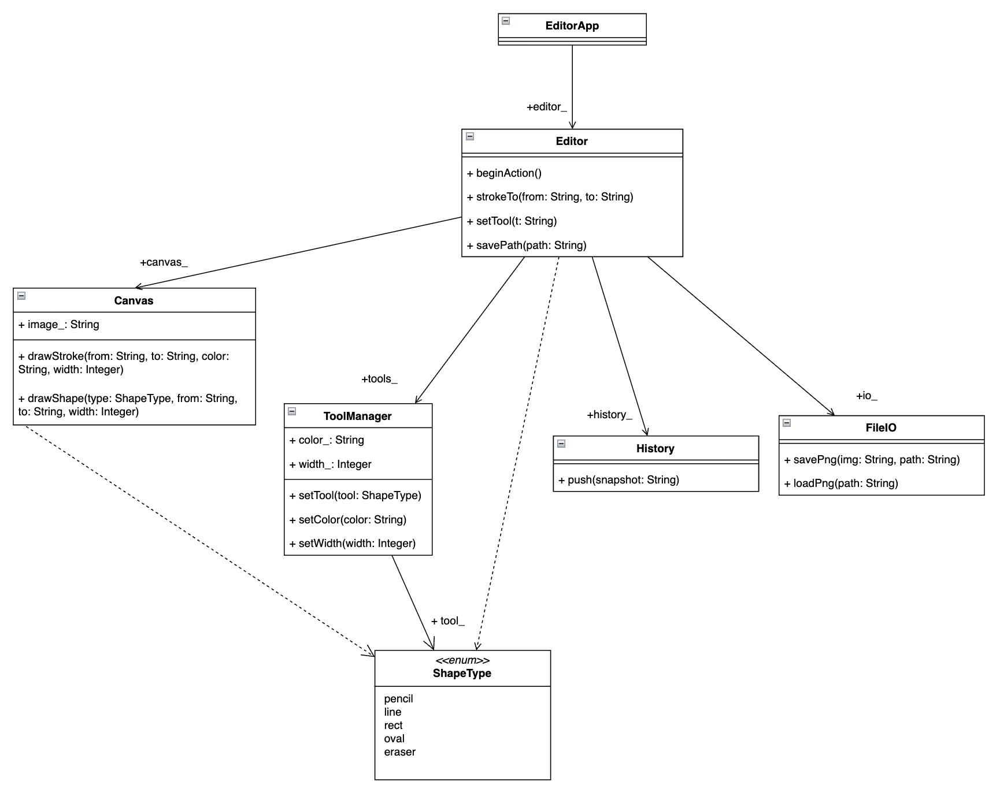

# Лабораторная работа №2 — Структурные паттерны

**Паттерн:** Фасад (Facade)
**Предметная область:** сервис аудиокниг

---

## 1. Постановка проблемы

Приложение для сервиса аудиокниг «DiBooks».

- **`Driver`** — отвечает за «скачивание» данных книги по URL (метаданные: автор, название).
- **`DB`** — локальная библиотека пользователя: хранит добавленные книги, поддерживает добавление, удаление и поиск.

**В чём проблема?** Если клиент (`BookApp`) работает с обеими подсистемами напрямую, возникает **сильная связанность** между классом клиента и классами подсистем:

- Клиент вынужден сам держать у себя объекты `Driver` и `DB`.
- Клиент сам координирует их взаимодействие
- Любое изменение в подсистемах заставит переписывать весь UI.
- Если нужно добавить нового клиента (например, консольную версию) — придётся дублировать всю координацию.

---

## 3. Реализация без паттерна

Клиент `BookApp` напрямую держит обе подсистемы и сам их координирует:

```cpp
class BookApp : public QWidget {
    Driver driver_;   
    DB     db_;       
    ...
    void onAddClicked() {
        auto maybeBook = driver_.getBook(url);
        if (!maybeBook.has_value()) { /* ошибка */ return; }
        db_.addBook(maybeBook.value());
    }

    void onSearchClicked() {
        auto found = db_.searchBooks(query);  // клиент знает метод DB
        ...
    }
};
```

### Минусы
- **Сильная связанность** клиента с обеими подсистемами (`Driver` + `DB`).
- При изменении интерфейса `Driver` или `DB` переписывать придётся весь `BookApp`.
- Появление новых клиентов приведёт к дублированию кода.
- Тестировать `BookApp` в отрыве от реальных `Driver` и `DB` невозможно без серьёзных переделок.

---

## 4. Реализация с паттерном Фасад

Рассмотрим реализацию паттерна на примере диаграммы классов.



Вводим класс `DiBooks` — **фасад**, который прячет обе подсистемы:

```cpp
class DiBooks {
    Driver driver_;  
    DB     db_;       
public:
    std::vector<Book> getLibrary();
    Book               addBook(const std::string& url); 
    bool               removeBook(int index);
    std::vector<Book>  search(const std::string& query);
    int                count();
};
```

Теперь клиент работает **только с фасадом**:

```cpp
class BookApp : public QWidget {
    DiBooks dibooks_;   
    ...
    void onAddClicked() {
        try {
            dibooks_.addBook(url);   
        } catch (const std::exception& e) { /* ошибка */ }
    }

    void onSearchClicked() {
        auto found = dibooks_.search(query);  // клиент не знает про DB
    }
};
```

### Как именно применили фасад

Паттерн проектирования был применен путем внедрения класса посредника между пользователем и низкоуровневыми системами приложения

### Плюсы
- **Слабая связанность** клиента с подсистемой: `BookApp` зависит только от `DiBooks`.
- Координация подсистем находится в одном месте — внутри фасада.
- Легко добавить новый UI (консольный, веб) — он будет использовать тот же фасад.
- При изменении `Driver` или `DB` клиент трогать не нужно — правим только фасад.
- Интерфейс фасада выражен в терминах задачи («добавь книгу по URL», «найди книгу»), а не в терминах подсистем («скачай метаданные», «вставь в вектор»).

### Минусы
- Фасад рискует превратиться в «божественный объект», если через него тянуть вообще всё. С ростом системы его нужно декомпозировать.
- Если клиенту всё-таки нужен прямой доступ к низкоуровневым возможностям подсистемы, их придётся либо «пробрасывать» через фасад, либо оставлять подсистему публичной.

---

## 5. Вывод

Кодовая реализация **с фасадом** вводит класс `DiBooks`, который:
- скрывает `Driver` и `DB` от клиента;
- предоставляет единый высокоуровневый интерфейс в терминах задачи;
- фокусирует координацию подсистем в одном месте.
